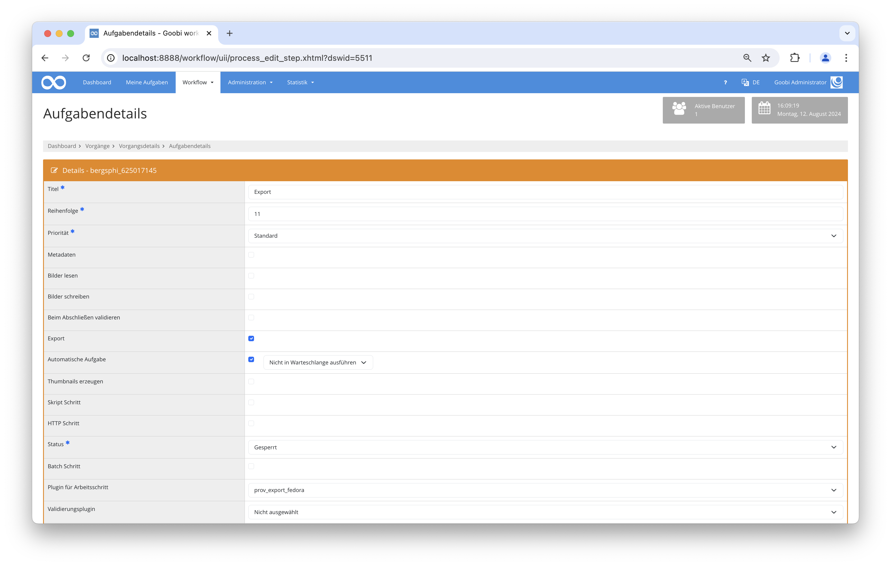

## Einführung
Die vorliegende Dokumentation beschreibt die Installation, die Konfiguration und den Einsatz des Fedora Export Plugins in Goobi workflow.


## Überblick und Funktionsweise
Es muss ein Export Schritt konfiguriert werden:

* Export DMS
* Automatische Aufgabe
* Plugin für Arbeitsschritt: FedoraExport

Bei der Ausführung des Schrittes wird ein Export des Goobi Vorgangs (analog zum Export ins Dateisystem) in das konfigurierte Fedora Repository unter Berücksichtigung der Konfiguration (siehe oben) eingespielt.

Es werden für die Bildung der Container-URLs bzw. von zusätzlichen Container-Attributen folgende Vorgangseigenschaften hinzugezogen (und sind unter Umständen zwingend erforderlich):

* barcode (enthält einen 10-stelligen Barcode oder eine 36-stellige PID)
* unit_Item_code (nur bei Barcodes)
* full_partial

Die Daten des Vorgangs lassen sich anschließend über das folgende URL-Muster im Repository abrufen:

```bash
http(s)://<Fedora REST endpoint>/records/<barcode.substring(0,4)>/<barcode.sunstring(4,8)>/<barcode.substring(8,10)>/
```



## Beispiele für die URLs nach erfolgreichem Ingest nach Fedora


### Beispiel mit Barcode (`barcode=“barcode123”`):

#### Hauptcontainer für die Bilder

[http://localhost:8888/fedora/rest/records/barc/ode1/234/images/](http://localhost:8888/fedora/rest/records/barc/ode1/234/images/)

#### Container für die Master-Bilder

[http://localhost:8888/fedora/rest/records/barc/ode1/234/images/1/files/master_00000001.tif](http://localhost:8888/fedora/rest/records/barc/ode1/234/images/1/files/master_00000001.tif)  
[http://localhost:8888/fedora/rest/records/barc/ode1/234/images/2/files/master_00000002.tif](http://localhost:8888/fedora/rest/records/barc/ode1/234/images/2/files/master_00000002.tif)  
[http://localhost:8888/fedora/rest/records/barc/ode1/234/images/3/files/master_00000003.tif](http://localhost:8888/fedora/rest/records/barc/ode1/234/images/3/files/master_00000003.tif)

#### Container für die JP2-Derivate

[http://localhost:8888/fedora/rest/records/barc/ode1/234/images/1/files/00000001.jp2](http://localhost:8888/fedora/rest/records/barc/ode1/234/images/1/files/00000001.jp2)  
[http://localhost:8888/fedora/rest/records/barc/ode1/234/images/2/files/00000002.jp2    
](http://localhost:8888/fedora/rest/records/barc/ode1/234/images/2/files/00000002.jp2)[http://localhost:8888/fedora/rest/records/barc/ode1/234/images/3/files/00000003.jp2](http://localhost:8888/fedora/rest/records/barc/ode1/234/images/3/files/00000003.jp2)


### Beispiel mit PID (`barcode=“`DB0027DB-F83B-11E9-AE98-A392051B17E6`”`):

#### Hauptcontainer für die Bilder

[http://localhost:8888/fedora/rest/records/](http://localhost:8888/fedora/rest/records/barc/ode1/234/images/)[DB/00/27/DB/-F83B-11E9-AE98-A392051B17E6](https://dev-content.prov.vic.gov.au/rest/records/DB/00/27/DB/F83B11E9AE98A392051B17E6)  
[/images/](http://localhost:8888/fedora/rest/records/barc/ode1/234/images/)

#### Container für die Master-Bilder

[http://localhost:8888/fedora/rest/records/](http://localhost:8888/fedora/rest/records/barc/ode1/234/images/1/files/master_00000001.tif)[DB/00/27/DB/-F83B-11E9-AE98-A392051B17E6](https://dev-content.prov.vic.gov.au/rest/records/DB/00/27/DB/F83B11E9AE98A392051B17E6)  
[/images/1/files/master_00000001.tif](http://localhost:8888/fedora/rest/records/barc/ode1/234/images/1/files/master_00000001.tif)  
[http://localhost:8888/fedora/rest/records/](http://localhost:8888/fedora/rest/records/barc/ode1/234/images/2/files/master_00000002.tif)[DB/00/27/DB/-F83B-11E9-AE98-A392051B17E6](https://dev-content.prov.vic.gov.au/rest/records/DB/00/27/DB/F83B11E9AE98A392051B17E6)[/images/2/files/master_00000002.tif](http://localhost:8888/fedora/rest/records/barc/ode1/234/images/2/files/master_00000002.tif)  
[http://localhost:8888/fedora/rest/records/](http://localhost:8888/fedora/rest/records/barc/ode1/234/images/3/files/master_00000003.tif)[DB/00/27/DB/-F83B-11E9-AE98-A392051B17E6](https://dev-content.prov.vic.gov.au/rest/records/DB/00/27/DB/F83B11E9AE98A392051B17E6)[/images/3/files/master_00000003.tif](http://localhost:8888/fedora/rest/records/barc/ode1/234/images/3/files/master_00000003.tif)

#### Container für die JP2-Derivate

[http://localhost:8888/fedora/rest/records/](http://localhost:8888/fedora/rest/records/barc/ode1/234/images/1/files/00000001.jp2)[DB/00/27/DB/-F83B-11E9-AE98-A392051B17E6](https://dev-content.prov.vic.gov.au/rest/records/DB/00/27/DB/F83B11E9AE98A392051B17E6)[/images/1/files/00000001.jp2](http://localhost:8888/fedora/rest/records/barc/ode1/234/images/1/files/00000001.jp2)  
[http://localhost:8888/fedora/rest/records/](http://localhost:8888/fedora/rest/records/barc/ode1/234/images/2/files/00000002.jp2)[DB/00/27/DB/-F83B-11E9-AE98-A392051B17E6](https://dev-content.prov.vic.gov.au/rest/records/DB/00/27/DB/F83B11E9AE98A392051B17E6)[/images/2/files/00000002.jp2    
](http://localhost:8888/fedora/rest/records/barc/ode1/234/images/2/files/00000002.jp2)[http://localhost:8888/fedora/rest/records/](http://localhost:8888/fedora/rest/records/barc/ode1/234/images/3/files/00000003.jp2)[DB/00/27/DB/-F83B-11E9-AE98-A392051B17E6](https://dev-content.prov.vic.gov.au/rest/records/DB/00/27/DB/F83B11E9AE98A392051B17E6)[/images/3/files/00000003.jp2](http://localhost:8888/fedora/rest/records/barc/ode1/234/images/3/files/00000003.jp2)


## Konfiguration
Die Konfiguration erfolgt über die Konfigurationsdatei `intranda_export_fedora.xml` und kann im laufenden Betrieb angepasst werden.

```xml
<config_plugin>
    <config>
        <!-- which workflow to use for (can be more then one, otherwise use *) -->
        <workflow>*</workflow>

        <!-- general Fedora configuration data -->
        <fedoraUrl>http://localhost:8080/fedora/rest</fedoraUrl>
        <useVersioning>false</useVersioning>
        <!-- Basic HTTP authentication user name (optional) -->
        <userName>foo</userName>
        <!-- Basic HTTP authentication password (optional) -->
        <password>bar</password>

        <!-- which content to ingest -->
        <ingestMaster>true</ingestMaster>
        <ingestMedia>false</ingestMedia>
        <ingestJp2>false</ingestJp2>
        <ingestPdf>false</ingestPdf>

        <!-- command for specific property including the parameter for Barcode and for the unit-or-item-type -->
        <externalLinkContent>
            PREFIX crm: &lt;http://www.cidoc-crm.org/cidoc-crm/&gt;
            INSERT { &lt;&gt; crm:P70_documents &lt;http://example.com/code=[UNIT_ITEM_CODE]&amp;entityId=[BARCODE]#&gt; }
            WHERE { }
        </externalLinkContent>

        <!-- command for specific property including the parameter for PID -->
        <externalLinkContentPID>
            PREFIX crm:&lt;http://www.cidoc-crm.org/cidoc-crm/&gt;
            INSERT { &lt;&gt; crm:P70_documents &lt;http://example.com/resolver?pid=/[PID]#&gt; }
            WHERE { }
        </externalLinkContentPID>

        <!-- command for specific property including the parameter for full_partial -->
        <fullPartialContent>
            PREFIX crm: &lt;http://www.cidoc-crm.org/cidoc-crm/&gt;
            INSERT { &lt;&gt; crm:P3_has_note "[FULL_PARTIAL]" }
            WHERE { }
        </fullPartialContent>

        <!-- Property containing the public release date (optional)-->
        <availableMetadataQuery>
            PREFIX dcterms: &lt;http://purl.org/dc/terms/&gt;
            INSERT {
                &lt;&gt; dcterms:available "[DATE_AVAILABLE]" .
            }
            WHERE { }
        </availableMetadataQuery>

        <!-- Properties query for the /images container -->
        <imagesContainerMetadataQuery>
            PREFIX ldp: &lt;http://www.w3.org/ns/ldp#&gt;
            PREFIX pcdm: &lt;http://pcdm.org/models#&gt;
            INSERT {
                &lt;&gt; a ldp:DirectContainer\,pcdm:Object ;
                ldp:membershipResource &lt;[URL]&gt; ;
                ldp:hasMemberRelation pcdm:hasMember .
            }
            WHERE { }
        </imagesContainerMetadataQuery>

        <!-- Properties query for the /files container -->
        <filesContainerMetadataQuery>
            PREFIX ldp: &lt;http://www.w3.org/ns/ldp#&gt;
            PREFIX pcdm: &lt;http://pcdm.org/models#&gt;
            INSERT {
                &lt;&gt; a ldp:DirectContainer\,pcdm:Object ;
                ldp:membershipResource &lt;[URL]&gt; ;
                ldp:hasMemberRelation pcdm:hasFile .
            }
            WHERE { }
        </filesContainerMetadataQuery>

        <!-- Properties query for the /fcr:metadata part of a file -->
        <imageFileMetadataQuery>
            PREFIX exif: &lt;https://www.w3.org/2003/12/exif/ns#&gt;
            INSERT {
                &lt;&gt;  exif:imageLength [HEIGHT] ;
                exif:imageWidth [WIDTH] .
            }
            WHERE { }
        </imageFileMetadataQuery>

    </config>

    <config>
        <!-- which workflow to use for (can be more then one, otherwise use *) -->
        <workflow>My_special_workflow</workflow>
        ...
    </config>
</config_plugin>
```

| Parameter | Erläuterung |
| :--- | :--- |
| `fedoraUrl` | REST Endpoint des Fedora Applikation |
| `useVersioning` | Wenn `true` gesetzt ist, wird die Revisionierung von Fedora verwendet. In diesem Fall wird für jeder Ausführung des Exportschrittes eine neue Revision des Vorgangs im Repository angelegt. Standardwert ist `true`. |
| `userName, password` | Optionale Basic HTTP Authentifizierung. Beide Werte müssen gesetzt sein, damit die Authentifizierung stattfindet. |
| `ingestMaster` | Wenn `true` gesetzt ist, werden die Master-Bilder des Vorgangs exportiert. Standardwert ist `true`. |
| `ingestMedia` | Wenn `true` gesetzt ist, werden die Derivate des Vorgangs exportiert. Standardwert ist `true`. |
| `ingestJp2` | Wenn `true` gesetzt ist, werden die JPEG2000-Bilder des Vorgangs in den Subcontainer `/media` exportiert. Standardwert ist `true`. |
| `ingestPdf` | Wenn `true` gesetzt ist, werden die PDFs des Vorgangs in den Subcontainer `/media` exportiert. Standardwert ist `true`. |
| `ingestMetsFile` | Wenn `true` gesetzt ist, eine METS/MODS Datei erzeugt und im Container Exportiert. Standardwert ist `true`. |
| `exportMetsFile` | Wenn `true` gesetzt ist, eine METS/MODS Datei erzeugt und in den üblichen Export-Ordner (z.B. `/hotfolder`) geschrieben. Standardwert ist `true`. |
| `externalLinkContent` | Externe URL mit Verwendung eines 10-stelligen Barcodes und des Unit Item Codes. |
| `externalLinkContentPID` | Externe URL mit Verwendung einer 36-stelligen PID. |
| `fullPartialContent` |  |
| `availableMetadataQuery` | Optionale SPARQL-Query, um das Veröffentlichungs-Datum als Attribut zum Root-Container des Werks hinzuzufügen. Die Prozesseigenschaft `available` muss hierfür gesetzt sein. |
| `imagesContainerMetadataQuery` | Optionale SPARQL-Query, um zusätzliche Attribute und Verlinkungen zum `/images`-Container hinzuzufügen. |
| `filesContainerMetadataQuery` | Optionale SPARQL-Query, um zusätzliche Attribute und Verlinkungen zum `/files`-Container hinzuzufügen. |
| `imageFileMetadataQuery` | Optionale SPARQL-Query, um für alle Bilddateien im Repository (unter z.B. `../00000001.tif/fcr:metadata`) zusätzliche Attribute zu schreiben. |

Der Block `<config>` ist wiederholbar und kann so in unterschiedlichen Projekten verschiedene Metadaten definieren. Die Unterelemente `<workflow>` wird zur Prüfung genutzt, ob der vorliegende Block für den aktuellen Schritt genutzt werden soll. Dabei wird geprüft, ob es einen Eintrag gibt, der sowohl den Workflow-Namen enthält. Ist dies nicht der Fall, wird der Block mit `<workflow>*</workflow>` verwendet.
