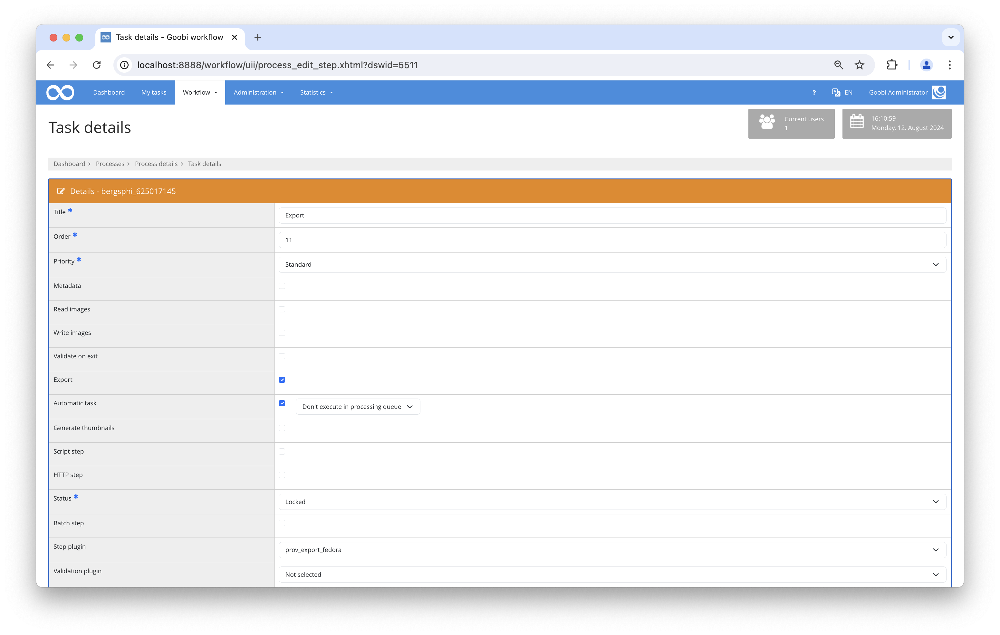

## Introduction
This documentation describes the installation, configuration and use of the Fedora Export Plugin in Goobi workflow.


## Overview and functionality
An export step must be configured:

* Export DMS
* Automatic task
* Plugin for step: FedoraExport

When the step is executed, the Goobi process is exported (in the same way as it is exported to the file system) to the configured Fedora Repository, taking into account the configuration (see above).

The following process properties are used to create container URLs or additional container attributes (and are mandatory):

* barcode (containing either a 10-character barcode or a 36-character PID)
* unit_Item_code (only mandatory when using a 10-digit barcode)
* full_partial

The process data can then be retrieved from the repository using the following URL pattern:

```bash
http(s)://<Fedora REST endpoint>/records/<barcode.substring(0,4)>/<barcode.sunstring(4,8)>/<barcode.substring(8,10)>/
```



## Examples of URLs after successful ingest to Fedora


### Example using a barcode (`barcode=“barcode123”`):

#### Main container for the pictures

[http://localhost:8888/fedora/rest/records/barc/ode1/234/images/](http://localhost:8888/fedora/rest/records/barc/ode1/234/images/)

#### Container for the master images

[http://localhost:8888/fedora/rest/records/barc/ode1/234/images/1/files/master_00000001.tif](http://localhost:8888/fedora/rest/records/barc/ode1/234/images/1/files/master_00000001.tif)  
[http://localhost:8888/fedora/rest/records/barc/ode1/234/images/2/files/master_00000002.tif](http://localhost:8888/fedora/rest/records/barc/ode1/234/images/2/files/master_00000002.tif)  
[http://localhost:8888/fedora/rest/records/barc/ode1/234/images/3/files/master_00000003.tif](http://localhost:8888/fedora/rest/records/barc/ode1/234/images/3/files/master_00000003.tif)

#### Containers for JP2 derivatives

[http://localhost:8888/fedora/rest/records/barc/ode1/234/images/1/files/00000001.jp2](http://localhost:8888/fedora/rest/records/barc/ode1/234/images/1/files/00000001.jp2)  
[http://localhost:8888/fedora/rest/records/barc/ode1/234/images/2/files/00000002.jp2    
](http://localhost:8888/fedora/rest/records/barc/ode1/234/images/2/files/00000002.jp2)[http://localhost:8888/fedora/rest/records/barc/ode1/234/images/3/files/00000003.jp2](http://localhost:8888/fedora/rest/records/barc/ode1/234/images/3/files/00000003.jp2)


### Example using a PID (`barcode=“DB0027DB-F83B-11E9-AE98-A392051B17E6”`):

#### Main container for the pictures

[http://localhost:8888/fedora/rest/records/](http://localhost:8888/fedora/rest/records/barc/ode1/234/images/)[DB/00/27/DB/-F83B-11E9-AE98-A392051B17E6](https://dev-content.prov.vic.gov.au/rest/records/DB/00/27/DB/F83B11E9AE98A392051B17E6)  
[/images/](http://localhost:8888/fedora/rest/records/barc/ode1/234/images/)

#### Container for the master images

[http://localhost:8888/fedora/rest/records/](http://localhost:8888/fedora/rest/records/barc/ode1/234/images/1/files/master_00000001.tif)[DB/00/27/DB/-F83B-11E9-AE98-A392051B17E6](https://dev-content.prov.vic.gov.au/rest/records/DB/00/27/DB/F83B11E9AE98A392051B17E6)  
[/images/1/files/master_00000001.tif](http://localhost:8888/fedora/rest/records/barc/ode1/234/images/1/files/master_00000001.tif)  
[http://localhost:8888/fedora/rest/records/](http://localhost:8888/fedora/rest/records/barc/ode1/234/images/2/files/master_00000002.tif)[DB/00/27/DB/-F83B-11E9-AE98-A392051B17E6](https://dev-content.prov.vic.gov.au/rest/records/DB/00/27/DB/F83B11E9AE98A392051B17E6)[/images/2/files/master_00000002.tif](http://localhost:8888/fedora/rest/records/barc/ode1/234/images/2/files/master_00000002.tif)  
[http://localhost:8888/fedora/rest/records/](http://localhost:8888/fedora/rest/records/barc/ode1/234/images/3/files/master_00000003.tif)[DB/00/27/DB/-F83B-11E9-AE98-A392051B17E6](https://dev-content.prov.vic.gov.au/rest/records/DB/00/27/DB/F83B11E9AE98A392051B17E6)[/images/3/files/master_00000003.tif](http://localhost:8888/fedora/rest/records/barc/ode1/234/images/3/files/master_00000003.tif)

#### Containers for JP2 derivatives

[http://localhost:8888/fedora/rest/records/](http://localhost:8888/fedora/rest/records/barc/ode1/234/images/1/files/00000001.jp2)[DB/00/27/DB/-F83B-11E9-AE98-A392051B17E6](https://dev-content.prov.vic.gov.au/rest/records/DB/00/27/DB/F83B11E9AE98A392051B17E6)[/images/1/files/00000001.jp2](http://localhost:8888/fedora/rest/records/barc/ode1/234/images/1/files/00000001.jp2)  
[http://localhost:8888/fedora/rest/records/](http://localhost:8888/fedora/rest/records/barc/ode1/234/images/2/files/00000002.jp2)[DB/00/27/DB/-F83B-11E9-AE98-A392051B17E6](https://dev-content.prov.vic.gov.au/rest/records/DB/00/27/DB/F83B11E9AE98A392051B17E6)[/images/2/files/00000002.jp2    
](http://localhost:8888/fedora/rest/records/barc/ode1/234/images/2/files/00000002.jp2)[http://localhost:8888/fedora/rest/records/](http://localhost:8888/fedora/rest/records/barc/ode1/234/images/3/files/00000003.jp2)[DB/00/27/DB/-F83B-11E9-AE98-A392051B17E6](https://dev-content.prov.vic.gov.au/rest/records/DB/00/27/DB/F83B11E9AE98A392051B17E6)[/images/3/files/00000003.jp2](http://localhost:8888/fedora/rest/records/barc/ode1/234/images/3/files/00000003.jp2)


## Configuration
The configuration is done via the configuration file `intranda_export_fedora.xml` and can be adapted during operation.

```xml
<config_plugin>
    <config>
        <!-- which workflow to use for (can be more then one, otherwise use *) -->
        <workflow>*</workflow>

        <!-- general Fedora configuration data -->
        <fedoraUrl>http://localhost:8080/fedora/rest</fedoraUrl>
        <useVersioning>false</useVersioning>
        <!-- Basic HTTP authentication user name (optional) -->
        <userName>foo</userName>
        <!-- Basic HTTP authentication password (optional) -->
        <password>bar</password>

        <!-- which content to ingest -->
        <ingestMaster>true</ingestMaster>
        <ingestMedia>false</ingestMedia>
        <ingestJp2>false</ingestJp2>
        <ingestPdf>false</ingestPdf>

        <!-- command for specific property including the parameter for Barcode and for the unit-or-item-type -->
        <externalLinkContent>
            PREFIX crm: &lt;http://www.cidoc-crm.org/cidoc-crm/&gt;
            INSERT { &lt;&gt; crm:P70_documents &lt;http://example.com/code=[UNIT_ITEM_CODE]&amp;entityId=[BARCODE]#&gt; }
            WHERE { }
        </externalLinkContent>

        <!-- command for specific property including the parameter for PID -->
        <externalLinkContentPID>
            PREFIX crm:&lt;http://www.cidoc-crm.org/cidoc-crm/&gt;
            INSERT { &lt;&gt; crm:P70_documents &lt;http://example.com/resolver?pid=/[PID]#&gt; }
            WHERE { }
        </externalLinkContentPID>

        <!-- command for specific property including the parameter for full_partial -->
        <fullPartialContent>
            PREFIX crm: &lt;http://www.cidoc-crm.org/cidoc-crm/&gt;
            INSERT { &lt;&gt; crm:P3_has_note "[FULL_PARTIAL]" }
            WHERE { }
        </fullPartialContent>

        <!-- Property containing the public release date (optional)-->
        <availableMetadataQuery>
            PREFIX dcterms: &lt;http://purl.org/dc/terms/&gt;
            INSERT {
                &lt;&gt; dcterms:available "[DATE_AVAILABLE]" .
            }
            WHERE { }
        </availableMetadataQuery>

        <!-- Properties query for the /images container -->
        <imagesContainerMetadataQuery>
            PREFIX ldp: &lt;http://www.w3.org/ns/ldp#&gt;
            PREFIX pcdm: &lt;http://pcdm.org/models#&gt;
            INSERT {
                &lt;&gt; a ldp:DirectContainer\,pcdm:Object ;
                ldp:membershipResource &lt;[URL]&gt; ;
                ldp:hasMemberRelation pcdm:hasMember .
            }
            WHERE { }
        </imagesContainerMetadataQuery>

        <!-- Properties query for the /files container -->
        <filesContainerMetadataQuery>
            PREFIX ldp: &lt;http://www.w3.org/ns/ldp#&gt;
            PREFIX pcdm: &lt;http://pcdm.org/models#&gt;
            INSERT {
                &lt;&gt; a ldp:DirectContainer\,pcdm:Object ;
                ldp:membershipResource &lt;[URL]&gt; ;
                ldp:hasMemberRelation pcdm:hasFile .
            }
            WHERE { }
        </filesContainerMetadataQuery>

        <!-- Properties query for the /fcr:metadata part of a file -->
        <imageFileMetadataQuery>
            PREFIX exif: &lt;https://www.w3.org/2003/12/exif/ns#&gt;
            INSERT {
                &lt;&gt;  exif:imageLength [HEIGHT] ;
                exif:imageWidth [WIDTH] .
            }
            WHERE { }
        </imageFileMetadataQuery>

    </config>

    <config>
        <!-- which workflow to use for (can be more then one, otherwise use *) -->
        <workflow>My_special_workflow</workflow>
        ...
    </config>
</config_plugin>
```

| Parameter | Explanation |
| :--- | :--- |
| `fedoraUrl` | REST Endpoint of the Fedora application |
| `useVersioning` | If `true`, the versioning of Fedora is used. In this case, each time the export step is executed, a new version of the process is created in the repository. The default value is `true`. |
| `userName, password` | Optional Basic HTTP Authentication. Both values must be set for authentication to take place. |
| `ingestMaster` | If `true` is set, the master images of the operation are exported. The default value is `true`. |
| `ingestMedia` | If `true` is set, the derivatives of the transaction are exported. The default value is `true`. |
| `ingestJp2` | If `true`, the JPEG2000 images of the operation are exported to the `/media` subcontainer. The default value is `true`. |
| `ingestPdf` | If `true`, the PDFs of the operation are exported to the `/media` subcontainer. The default value is `true`. |
| `ingestMetsFile` | If `true` is set, a METS/MODS file is created and exported to the container. Default value is `true`. |
| `exportMetsFile` | If `true` is set, a METS/MODS file is created and written to the usual export folder (e.g. `/hotfolder`). Default value is `true`. |
| `externalLinkContent` | External URL using a 10-character barcode and the unit item code. |
| `externalLinkContentPID` | External URL using a 36-character PID. |
| `fullPartialContent` |  |
| `availableMetadataQuery` | Optional SPARQL query to add the publication date to the root container attribute of the plant. The process property `available` must be set for this. |
| `imagesContainerMetadataQuery` | Optional SPARQL query to add additional attributes and links to the `/images` container. |
| `filesContainerMetadataQuery` | Optional SPARQL query to add additional attributes and links to the `/files` container. |
| `imageFileMetadataQuery` | Optional SPARQL query to write additional attributes for all image files in the repository (under e.g. `../00000001.tif/fcr:metadata`). |

The `block` config is repeatable and can define different metadata in different projects. The `workflow` sub-element is used to check whether the current block is to be used for the current step. The system checks whether there is an entry that contains both the workflow name and the current step. If this is not the case, the block is used with `<workflow>*</workflow>`.
